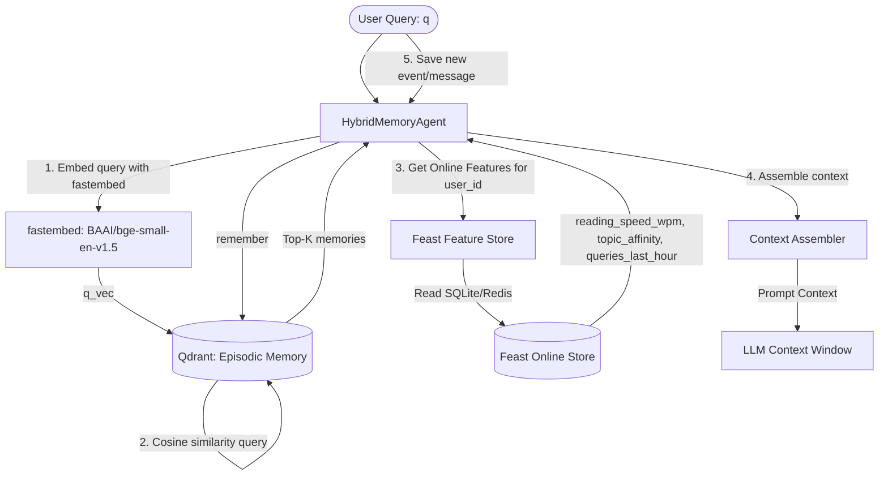

# Architecture Design — Personal AI Assistant with Hybrid Memory

This document outlines the architecture and design decisions for a personal AI assistant tailored for Vietnamese users, integrating both **Episodic Memory** (Vector Store) and a **Stable User Profile + Recent Activity** (Feature Store).

---

## 1. Architecture Diagram

The diagram below illustrates the data flow when a user sends a query to the assistant. The `HybridMemoryAgent` orchestrates the retrieval from Qdrant (episodic memory) and Feast (profile/activity features) to construct the final LLM context.

---

## 2. Key Architecture Decisions & Tradeoffs

### Decision 1: Chunking Strategy for Episodic Memory
- **Approach Chosen**: **Semantic-overlapping Chunking** (target chunk size of 256 tokens with a 32-token overlap). We split documents/conversations at sentence boundaries near the token limit rather than arbitrary token cuts.
- **Tradeoffs**:
  - **Retrieval Quality vs. Context Window**: Small chunks (e.g., single sentences) lead to high retrieval precision but lose local context, making the LLM response fragmented. Large chunks (e.g., entire conversations) preserve complete context but consume too many tokens in the LLM's limited context window and dilute the semantic vector representation. A 256-token chunk with overlap is the "sweet spot" for indexing technical notes and message pairs.
  - **Storage & Processing Cost**: Generating overlapping chunks increases the number of vectors in Qdrant by ~20-30%, resulting in higher memory usage. However, for a personal assistant scale, this overhead is negligible compared to the retrieval quality gain.

### Decision 2: Feature Schema Structure (Tabular vs. Latent Preferences)
- **Approach Chosen**: **Structured Tabular Features** stored in Feast (`reading_speed_wpm`, `preferred_language`, `topic_affinity` as strings/integers).
- **Tradeoffs**:
  - **Tabular vs. Embedding Features**: We could represent the user's stable profile as a latent preference embedding vector (e.g., a rolling average of their read documents' vectors). While embeddings capture subtle, non-verbal interests, they are black boxes and cannot easily be used to dynamically alter prompt instructions (e.g., "Write in English because `preferred_language == 'en'"`). Structured tabular features are human-interpretable, easy to debug, and directly map to business/routing logic in the prompt assembler.
  - **TTL (Time to Live)**: We set a 30-day TTL for the `user_profile_features` view since user preferences are slow-moving. However, for the `query_velocity_features`, we set a strict 1-hour TTL because recent activity (e.g., spikes in queries) decays rapidly and should not influence the assistant's behavior the next day.

### Decision 3: Feature Freshness Strategy
- **Approach Chosen**: A hybrid freshness model matching the nature of the data:
  - **Sub-second (Streaming/Push)**: Used for `query_velocity_features` (`queries_last_hour`). This ensures that if the user starts spamming queries, the system immediately recognizes a fatigue/spam state.
  - **Hourly/Hourly-batch**: Used for `item_popularity_features` (click rates, dwell times) where we capture document engagement patterns across the corpus.
  - **Daily Batch**: Used for `user_profile_features` where we recompute user preferences (preferred language, reading speed) from daily batch logs.
- **Tradeoffs**:
  - Higher freshness (streaming) requires running message queues (Kafka/Redis Streams) and ingestion workers, which increases infrastructure complexity and cost. Applying daily/hourly batches for stable profile components dramatically reduces database write overhead while maintaining sufficient user-context accuracy.

---

## 3. Rejected Alternative
We considered storing the user's episodic memories directly inside Feast as a custom File/Directory feature view. However, we **rejected** this approach for the following reasons:
1. **Retrieval Access Pattern**: Feast is optimized for key-value lookups by Entity ID (e.g., fetching a specific user's row by `user_id`). Episodic memory, on the other hand, requires **similarity-based vector search** (unstructured query matched against thousands of chunks via cosine distance), which Feast's online store cannot perform natively.
2. **Indexing and Update Cycles**: Episodic memory changes on every user message (high-frequency writes and immediate index updates). Feature views like user profiles change slowly and are recomputed in batches. Decoupling the Vector Store (Qdrant) from the Feature Store (Feast) allows us to scale retrieval and ingestion independently.

---

## 4. Vietnamese-Context Considerations

- **Code-Switching (Vi-En Mix)**: Vietnamese developers heavily mix English and Vietnamese terminology (e.g., *"deploy k8s lên cloud GCP"* or *"config VPC network"*). To handle this, the choice of embedding model is critical. While a pure English model like `bge-small-en` is lightweight, it struggles with Vietnamese grammar. A multilingual model like `bge-m3` or `text-embedding-3-large` handles code-switched queries natively because their tokenizers and pretraining corpora include bilingual contexts.
- **NLP Tokenization**: We evaluated two tokenization strategies:
  1. **Whitespace Splitting**: Quick, simple, and doesn't require extra libraries.
  2. **Compound Word Tokenization (using `underthesea` or `pyvi`)**: In Vietnamese, spaces are used between syllables, not necessarily words (e.g., "điện toán đám mây" is 4 syllables but 1 semantic concept).
  - **Tradeoff**: While compound tokenization yields better lexical match precision for BM25, it introduces CPU bottlenecks (10-50ms latency overhead per query) and requires external C-bindings. Since vector embeddings handle semantic phrases natively, we stick to simple whitespace tokenization for BM25 to keep latency low, relying on the vector DB to capture the multi-syllable concepts.

---

## 5. Limitations of this POC

- **Multi-User Privacy Isolation**: This POC uses a single shared Qdrant collection. In a production environment, user data must be strictly isolated. We would need to implement Qdrant metadata filters matching the `user_id` on every query, or use separate collections/namespaces per user.
- **Encryption at Rest**: Episodic memory contains private user conversations. In a real-world scenario, these vector payloads and SQLite records must be encrypted with user-specific keys.
- **Sync/Scale**: SQLite is used for the Feast online store in this Lite path, which is single-process. Production would require migrating to Redis or DynamoDB to support distributed, multi-region scaling.
